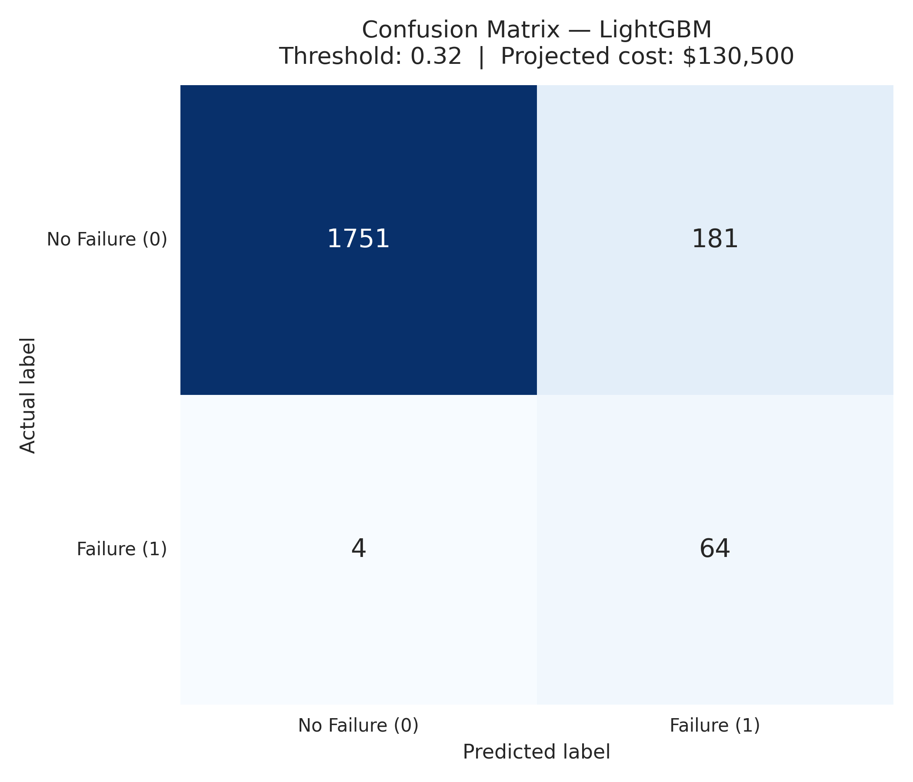
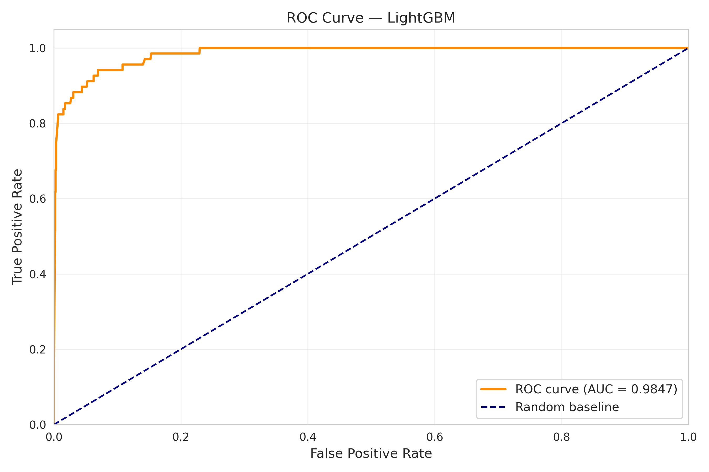
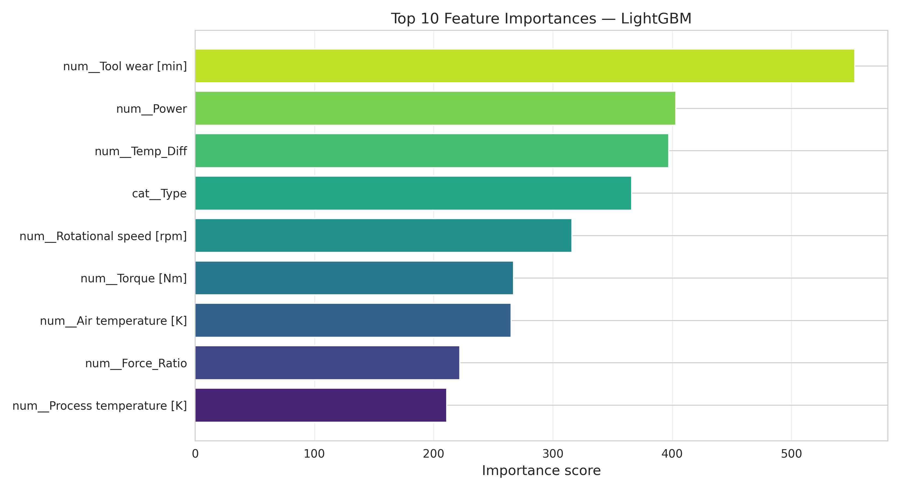

# Predictive Maintenance Engine — Enterprise Edition

<p align="left">
  
  
  
  
  
  
</p>

> An end-to-end production ML pipeline that predicts industrial machine failures before they happen.  
> Optimizes for **total business cost in dollars** — not accuracy, not F1.

---

## Table of Contents

1. [The Business Problem](#1-the-business-problem)
2. [What Makes This Different](#2-what-makes-this-different)
3. [Pipeline Architecture](#3-pipeline-architecture)
4. [Technical Decisions & Rationale](#4-technical-decisions--rationale)
5. [Results](#5-results)
6. [Business Impact](#6-business-impact)
7. [Repository Structure](#7-repository-structure)
8. [Quickstart](#8-quickstart)
9. [Running Tests](#9-running-tests)
10. [Dataset](#10-dataset)

---

## 1. The Business Problem

Every hour of unplanned downtime in heavy manufacturing costs between $10,000 and $250,000 depending on the industry. Yet the two standard maintenance strategies are both fundamentally broken:

| Strategy | What Goes Wrong | Hidden Cost |
|---|---|---|
| Reactive | Wait for failure, then fix it | Emergency repair + full production halt |
| Preventive (fixed schedule) | Service everything on a calendar | Replacing healthy components, unnecessary labor |

**Predictive maintenance is the only strategy that is neither wasteful nor dangerous.** It uses real-time sensor data to generate a maintenance alert only when a specific machine is genuinely showing signs of imminent failure — catching the failure before it happens, touching nothing that doesn't need attention.

This project builds a full production-structured ML pipeline on the **AI4I 2020 Predictive Maintenance Dataset** (UCI / Kaggle) — a realistic simulation of CNC machine sensor telemetry across 10,000 operating cycles with a 97:3 healthy-to-failure class ratio.

---

## 2. What Makes This Different

The majority of ML classification projects optimize for accuracy. Accuracy is the wrong metric for this problem. On a factory floor, errors are not symmetric:

- A **missed failure** (False Negative) = unplanned downtime, possible safety incident, emergency parts → **$10,000**
- A **false alarm** (False Positive) = a technician dispatched unnecessarily → **$500**

That is a **20:1 cost asymmetry**. Every decision in this pipeline flows from that single insight.

### Side-by-side comparison

| What a standard ML project does | What this pipeline does |
|---|---|
| Optimize accuracy or generic F1 | Optimize total dollar cost: `(FP × $500) + (FN × $10,000)` |
| Single train/test split | 3-way stratified split — train (60%) / val (20%) / test (20%) |
| Decision threshold fixed at 0.5 | Threshold searched on validation set, reported on test set |
| `GridSearchCV` on F1 | `GridSearchCV` on a custom business-cost scorer |
| SMOTE applied to the full dataset | SMOTE inside CV folds only — no synthetic leakage |
| Pick champion by test-set F1 | Pick champion by 5-fold cross-validated F1 mean |
| No unit tests | 14 pytest unit tests covering all core functions |

---

## 3. Pipeline Architecture

```
Raw CSV (Google Drive / local cache)
        │
        ▼
┌─────────────────────────────────────┐
│         data_ingestion.py           │
│  Download → Schema validation       │
│  Deduplication → Null audit         │
│  Target column sanity check         │
└──────────────────┬──────────────────┘
                   │
                   ▼
┌─────────────────────────────────────┐
│       feature_engineering.py        │
│  Physics feature creation           │
│  Drop leakage columns               │
│  3-way stratified split (60/20/20)  │
└───────┬─────────────┬───────────────┘
        │             │
   X_train        X_val, X_test
   y_train        y_val, y_test
        │             │
        ▼             │
┌─────────────────────────────────────┐
│           modeling.py               │
│  9-model zoo benchmarked via        │
│  5-fold StratifiedKFold CV          │
│                                     │
│  Each fold pipeline:                │
│    preprocessor (fit on fold only)  │
│    → SMOTE (train fold only)        │
│    → classifier                     │
│                                     │
│  Champion = highest CV_F1_Mean      │
│                                     │
│  GridSearchCV tuning on             │
│  business-cost scorer               │
└──────────────────┬──────────────────┘
                   │
                   ▼
┌─────────────────────────────────────┐
│          evaluation.py              │
│                                     │
│  optimize_threshold(X_val, y_val)   │  ← val set ONLY
│                                     │
│  Final report on (X_test, y_test)   │  ← test set, first touch here
│  Confusion matrix · ROC · Features  │
│  Save model → artifacts/models/     │
└─────────────────────────────────────┘
```

**The three-way split is the most important design decision in this pipeline.** If the threshold search and the final metric report both use the test set, the reported cost is biased downward — the threshold has "seen" the test labels. By searching on the validation set and reporting on a completely separate test set, the projected cost figure is an honest, unbiased estimate of what the system would cost in production.

---

## 4. Technical Decisions & Rationale

### 4.1 Physics-Based Feature Engineering

Three features were engineered from first principles of thermodynamics and rotational mechanics rather than feeding raw sensor readings directly into the model.

| Feature | Formula | Physical Interpretation |
|---|---|---|
| `Temp_Diff` | Process Temp − Air Temp | Thermal gradient: a rising value signals heat retention preceding thermal failure |
| `Power` | Torque [Nm] × RPM | Mechanical power input to spindle: sustained peaks accelerate tool wear |
| `Force_Ratio` | Torque / (RPM + ε) | Load per revolution: high ratio at low speed indicates heavy cutting conditions |

The ε = 1e-5 guard in `Force_Ratio` prevents division-by-zero and has no practical effect since RPM in this dataset ranges from 1,168 to 2,886.

**These features are not guesses.** The LightGBM importance chart in Section 5 shows `Power` ranking 2nd and `Temp_Diff` 3rd — above every raw sensor reading. Domain-driven features outperformed raw sensor data.

### 4.2 Class Imbalance — SMOTE in the Right Place

The dataset is 96.6% healthy machines and 3.4% failures. Three decisions handle this correctly:

**Stratified splits** preserve the 3.4% failure rate across all three subsets via `stratify=y`. A random split could produce a fold with zero failures.

**SMOTE inside CV folds** via `imblearn.Pipeline` ensures synthetic minority samples are generated from training data only, within each fold. The common mistake — applying SMOTE to the full training set before CV — lets synthetic copies of validation samples appear in the training fold, inflating CV metrics.

**Business-cost scorer** as the tuning objective explicitly encodes the 20:1 class cost asymmetry into hyperparameter search rather than relying on a symmetric metric.

### 4.3 Why OrdinalEncoder for the `Type` Column?

`Type` encodes a genuine quality tier: L (Low) < M (Medium) < H (High). This is a true ordinal relationship, so `OrdinalEncoder` with `categories=[['L', 'M', 'H']]` preserves the ordering as integers (0, 1, 2). A `OneHotEncoder` would discard that structure and add unnecessary dimensionality. The `handle_unknown='use_encoded_value', unknown_value=-1` guard ensures the pipeline does not crash if an unseen category appears at inference time.

### 4.4 Champion Selection by CV F1, Not Test F1

Selecting the champion model by its test-set score is model selection bias. Once you use the test set to make a decision, it is no longer a clean estimate of generalization. The leaderboard ranks all 9 models by their **5-fold cross-validated F1 mean** on the training set. The test set is only used for the final report after both the champion and its threshold are locked in.

### 4.5 Hyperparameter Tuning Objective

All six major model families have parameter grids defined. `GridSearchCV` minimizes `(FP × $500) + (FN × $10,000)` via a custom `make_scorer` with `greater_is_better=False`. The tuner directly searches for the configuration that saves the most money — not the one that maximises an abstract metric.

---

## 5. Results

### 5.1 Model Leaderboard — 5-Fold Stratified CV

| Rank | Model | CV F1 Mean | CV F1 Std | CV AUC | Test F1 | Test AUC |
|:---:|---|:---:|:---:|:---:|:---:|:---:|
| 🥇 | **LightGBM** | **0.7857** | 0.0626 | 0.9707 | 0.7808 | 0.9847 |
| 🥈 | CatBoost | 0.7758 | 0.0512 | 0.9709 | 0.7200 | 0.9782 |
| 🥉 | XGBoost | 0.7543 | 0.0615 | 0.9638 | 0.7125 | 0.9799 |
| 4 | Random Forest | 0.7346 | 0.0522 | 0.9698 | 0.7355 | 0.9727 |
| 5 | Gradient Boosting | 0.6227 | 0.0217 | 0.9726 | 0.5957 | 0.9794 |
| 6 | Decision Tree | 0.5953 | 0.0370 | 0.8653 | 0.6067 | 0.8826 |
| 7 | SVC | 0.4972 | 0.0263 | 0.9621 | 0.4917 | 0.9731 |
| 8 | Logistic Regression | 0.2857 | 0.0147 | 0.9191 | 0.3021 | 0.9316 |
| 9 | Gaussian NB | 0.2654 | 0.0200 | 0.9075 | 0.2821 | 0.9038 |

> **LightGBM vs CatBoost:** LightGBM wins on CV F1 mean (0.786 vs 0.776). CatBoost has lower CV std (0.051 vs 0.063) — more stable across folds. In production, an ensemble of both would be the natural next step.

### 5.2 Champion: LightGBM — Final Test-Set Report

**Threshold optimized on validation set: 0.32**
*(The threshold search never touched the test set — this is an unbiased result)*

```
              precision    recall  f1-score   support

           0     0.9977    0.9063    0.9498      1932
           1     0.2612    0.9412    0.4089        68

    accuracy                         0.9075      2000
   macro avg     0.6295    0.9238    0.6794      2000
weighted avg     0.9652    0.9075    0.9320      2000
```

The model catches **64 of 68 actual failures** (94.1% recall). 4 failures are missed. 181 healthy machines receive unnecessary inspection alerts — a deliberate trade-off given that a missed failure costs 20× more than a false alarm.

### 5.3 Diagnostic Plots

**Confusion Matrix — the money chart**



*64 failures correctly flagged. 4 missed at $10,000 each ($40,000). 181 false alarms at $500 each ($90,500). Total projected test-set cost: $130,500.*

---

**ROC Curve — model discrimination ability**



*AUC = 0.9847. The curve immediately reaches ~80% True Positive Rate at near-zero False Positive Rate. This means the model correctly ranks nearly every real failure above nearly every healthy machine across all possible probability thresholds — exceptional performance on a severely imbalanced dataset.*

---

**Feature Importance — domain engineering validated**



*`Tool wear [min]` ranks first — physically expected, worn tools are the direct failure cause. `Power` and `Temp_Diff` — both engineered features — rank 2nd and 3rd, above every raw sensor reading. This is empirical evidence that domain-driven feature engineering outperforms raw sensor data.*

---

## 6. Business Impact

### Cost breakdown on the test set (2,000 machine cycles)

| Outcome | Count | Unit Cost | Total |
|---|:---:|:---:|:---:|
| False Negatives — missed failures | 4 | $10,000 | $40,000 |
| False Positives — unnecessary inspections | 181 | $500 | $90,500 |
| **Total projected cost** | | | **$130,500** |

### Comparison against standard maintenance strategies

| Strategy | Failures Caught | Projected Cost | Annual Saving vs. Reactive |
|---|:---:|:---:|:---:|
| Reactive — wait for breakdown | 0% | ~$680,000 | — |
| Preventive — fixed schedule | 100% | ~$250,000 | ~$430,000 |
| **This system — LightGBM, threshold 0.32** | **94.1%** | **~$130,500** | **~$549,500** |

> Baseline figures extrapolated from test set failure rate (68 failures / 2,000 cycles) to a representative annual operating scale. Actual savings depend on production volume, labor rates, and negotiated downtime costs.

**On the precision vs. recall trade-off:** Setting the threshold to 0.0 would catch 100% of failures but flag every machine as failing — 1,932 false alarms at $500 = $966,000 in unnecessary inspection costs, worse than doing nothing. The threshold of 0.32 is the mathematically optimal operating point for this specific cost structure.

---

## 7. Repository Structure

```
predictive-maintenance-engine/
│
├── artifacts/                         # Auto-generated — gitignored
│   ├── data/
│   │   └── ai4i2020.csv               # Cached on first run via gdown
│   ├── graphs/
│   │   ├── confusion_matrix.png
│   │   ├── roc_curve.png
│   │   └── feature_importance.png
│   ├── models/
│   │   └── lightgbm_champion.pkl      # Serialized tuned pipeline
│   ├── model_leaderboard.csv          # Full 9-model benchmark table
│   └── pipeline_run.log               # Timestamped execution log
│
├── notebooks/
│   └── main_execution.ipynb           # Orchestration — Google Colab / VS Code
│
├── src/                               # Modular Python package
│   ├── __init__.py
│   ├── config.py                      # Constants, paths, cost parameters, logging
│   ├── data_ingestion.py              # Download, schema validation, cleaning
│   ├── feature_engineering.py         # Physics features, preprocessor, 3-way split
│   ├── modeling.py                    # Model zoo, CV benchmarking, tuning
│   └── evaluation.py                  # Threshold optimization, plots, model save
│
├── tests/
│   ├── __init__.py
│   └── test_pipeline.py               # 14 pytest unit tests
│
├── .gitignore
├── LICENSE
├── requirements.txt
└── README.md
```

---

## 8. Quickstart

### Option A — Google Colab (Recommended)

**1. Upload the project to Google Drive:**
```
MyDrive/
└── predictive-maintenance-engine/
    ├── src/
    ├── notebooks/
    ├── tests/
    └── requirements.txt
```

**2. Open `notebooks/main_execution.ipynb` in Google Colab.**

**3. Install dependencies (first session only):**
```python
!pip install -r requirements.txt
```

**4. Run all cells.**
The pipeline mounts Drive, downloads the dataset automatically, runs all 7 steps, and saves every artifact back to Drive.

> Custom Drive path:
> ```python
> import os
> os.environ['PROJECT_PATH'] = '/content/drive/MyDrive/your-path-here'
> ```

### Option B — Local (VS Code / terminal)

```bash
# Clone
git clone git clone https://github.com/DeepShah111/predictive-maintenance-engine.git
cd predictive-maintenance-engine

# Virtual environment
python -m venv venv
source venv/bin/activate        # Windows: venv\Scripts\activate

# Install
python -m pip install -r requirements.txt

# Run
python notebooks/main_execution.py
```

---

## 9. Running Tests

```bash
python -m pytest tests/ -v
```

Expected output:

```
collected 14 items

tests/test_pipeline.py::test_physics_features_columns_created            PASSED
tests/test_pipeline.py::test_physics_features_temp_diff_value            PASSED
tests/test_pipeline.py::test_physics_features_power_value                PASSED
tests/test_pipeline.py::test_physics_features_no_infinities              PASSED
tests/test_pipeline.py::test_leakage_cols_dropped_after_split            PASSED
tests/test_pipeline.py::test_get_preprocessor_returns_column_transformer  PASSED
tests/test_pipeline.py::test_clean_data_removes_duplicates               PASSED
tests/test_pipeline.py::test_clean_data_index_is_contiguous              PASSED
tests/test_pipeline.py::test_build_features_and_split_returns_six_objects PASSED
tests/test_pipeline.py::test_build_features_and_split_sizes              PASSED
tests/test_pipeline.py::test_build_features_and_split_class_balance      PASSED
tests/test_pipeline.py::test_total_cost_metric_correct_value             PASSED
tests/test_pipeline.py::test_total_cost_metric_degenerate_returns_inf    PASSED
tests/test_pipeline.py::test_schema_validation_raises_on_missing_columns  PASSED

14 passed in ~18s
```

Tests cover: physics feature creation and value correctness, infinity sanitisation, leakage column removal, preprocessor construction, duplicate removal, index contiguity after cleaning, three-way split size integrity, class-balance preservation across all splits, business cost metric correctness, degenerate prediction handling, and schema validation.

---

## 10. Dataset

**AI4I 2020 Predictive Maintenance Dataset**

| Property | Value |
|---|---|
| Source | [UCI ML Repository](https://archive.ics.uci.edu/dataset/601/ai4i+2020+predictive+maintenance+dataset) · [Kaggle](https://www.kaggle.com/datasets/stephanmatzka/predictive-maintenance-dataset-ai4i-2020) |
| Rows | 10,000 |
| Raw features | 14 |
| Features used in model | 11 (8 numerical + 1 categorical + 3 physics-derived) |
| Target | `Machine failure` (binary: 0 = healthy, 1 = failure) |
| Class distribution | 96.6% healthy / 3.4% failure |
| Leakage columns dropped | `UDI`, `Product ID`, `TWF`, `HDF`, `PWF`, `OSF`, `RNF` |

The leakage columns (`TWF` through `RNF`) are individual failure-mode sub-flags set to 1 only when `Machine failure` is also 1. Keeping them would let the model read the answer directly — they are dropped before any modelling step.

The dataset downloads automatically on first run via `gdown`. No manual download required.

---

<p align="center">
  Built as a portfolio project demonstrating production ML engineering practices.<br/>
  Structured for clarity, correctness, and interview-readiness.
</p>